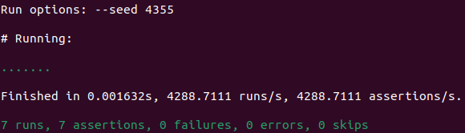
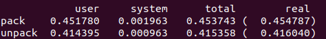

# Short String Packer
> **Name:** Syaheer Altaf (阿爾塔夫)  
> **Student ID:** 12345678

*Disclaimer: All Ruby code in this repository has passed `rubocop` formatting checks. Any suggested offenses were corrected immediately.*

`pack(str)` accepts a string composed solely of the 26 lowercase letters of the alphabet and returns a compressed integer representation of that string. For simplicity, error handling for invalid inputs is not implemented. The complementary method, `unpack(packed)`, reverses the process.

1. Implementation for `short_string_packer.rb` ([see](short_string_packer)):

The implementation is available in [`short_string_packer.rb`](short_string_packer.rb):

```ruby
module ShortStringPacker
  def self.pack(str)
    n_bit_shift = Math.log2(26).ceil
    str.chars.reduce(0) do |num, char|
      (num << n_bit_shift) | (char.ord - 'a'.ord + 1)
    end
  end

  def self.unpack(packed)
    n_bit_shift = Math.log2(26).ceil
    masked_values = packed.digits(2**n_bit_shift).reverse
    masked_values.map { |n| (n + 'a'.ord - 1).chr }.join
  end
end
```
2. Results from running `ruby packer_spec.rb` and `ruby packer_bench.rb`:

  


## Some thoughts for this Assignment

The implementation of `pack(str)` is straightforward. Each letter is mapped to a number from 1 to 26, and since 26 can be represented in 5 bits, every character is encoded using at least 5 bits. The algorithm shifts the current result left by 5 bit width and then uses the bitwise OR operation to append the new character’s value. This effectively compresses the string into a smaller number of bits.

For example, consider the word `"abbreviation"` shown in `irb`:

```
irb(main):001> require './short_string_packer'
=> true
irb(main):002> s = "abbreviation"
=> "abbreviation"
irb(main):003> s.bytesize * 8
=> 96
irb(main):004> (ShortStringPacker.pack(s)).bit_length
=> 56
```

Here, the original string requires 96 bits, while the packed integer only needs 56 bits—a saving of 40 bits.

### Alternate Approach for `unpack`

An alternative implementation for `unpack(packed)` would involve:

1. Defining a mask for the 5-bit groups (e.g., `mask = (1 << n_bit_shift) - 1`).
2. Using a loop to extract the least significant 5 bits at a time by applying the bitwise AND with the mask.
3. Shifting the integer to the right after each extraction until the entire number is processed.
4. Reversing the order of the extracted values and converting each to its corresponding character.

### The Chosen Approach for `unpack`
Ruby's `digits` method can be used to achieve a similar result by treating the packed number as being in base `32`. This method splits the number into its constituent digits, which are then converted back into characters.
